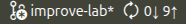
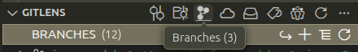
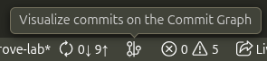
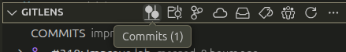
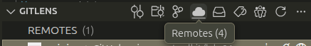

# `GitLens`

`GitLens` is a `VS Code` extension that simplifies work with `Git` inside `VS Code`.

See [`GitLens` features](https://help.gitkraken.com/gitlens/gitlens-features/).

## See all branches

See all branches using any of these approaches:

<!-- no toc -->
- [See all branches using the `Status Bar`](#see-all-branches-using-the-status-bar)
- [See all branches using the `Source Control`](#see-all-branches-using-the-source-control)

### See all branches using the `Status Bar`

1. Go to the [`Status Bar`](./vs-code.md#status-bar).
2. Look at the branch name.

   </img>
3. Click it to see all available branches.
4. If you click a branch, you'll be able to switch to it.

### See all branches using the `Source Control`

1. [Open the `Source Control`](./vs-code.md#open-the-source-control).
2. Click `GITLENS` to uncollapse the view.
3. Click the icon `Branches`.

   </img>

## Look at the commit graph

1. Go to the [`Status Bar`](./vs-code.md#status-bar).
2. Click the icon `Visualize commits on the Commit Graph`.

   </img>
3. Make sure you can see the commit graph.

## Inspect the current branch

1. [Open the `Source Control`](./vs-code.md#open-the-source-control).
2. Click `GITLENS`.
3. Click the icon `Commits`.

   </img>
4. See `COMMITS <branch-name>`.
5. See commits below it.
6. Click a commit to open a list of files changed in that commit.
7. Click a file changed in that commit to see changes in that file.

## Inspect remotes

1. [Open the `Source Control`](./vs-code.md#open-the-source-control).
2. Click `GITLENS` to uncollapse the view.
3. Hover over the `GITLENS` view name.
4. Click the icon `Remotes`.

    </img>
5. Make sure `origin` points to your repo URL:
   1. Hover over `origin`.
   2. Look at URLs.
